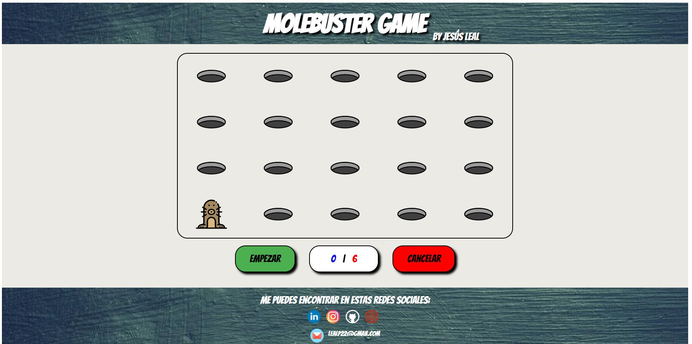

### Bootcamp Full Stack Developer - Upgrade Hub
## Proyecto JavaScript - MoleBuster
---

Página Web creada utilizando HTML5, SCSS (CSS) y JavaScript como proyecto del segundo módulo del bootcamp.

La idea es crear una web con uno de los juegos más famosos de la historia: **MoleBuster**. Para ello se genera una matriz (array bidimensional) que empieza con la imagen de un agujero y cada 'x' segundos cambia esa imagen por la de un Castor. Si el usuario hace click sobre la imagen, suma uno en su contador.

* Se puede ver en: [https://jesusleal-molebuster.netlify.app/](https://jesusleal-molebuster.netlify.app/)

* Todo el código fuente está disponible en el repositorio:
[https://github.com/portfolio-jesus-leal/proyecto-javascript-molebuster-jesus-leal](https://github.com/portfolio-jesus-leal/proyecto-javascript-molebuster-jesus-leal)

...

**Estructura:**

Componentes creados:
- index.html
- index.js
- styles/styles.scss
- styles/style.css (Generado a partir de styles.scss)
- images/*
